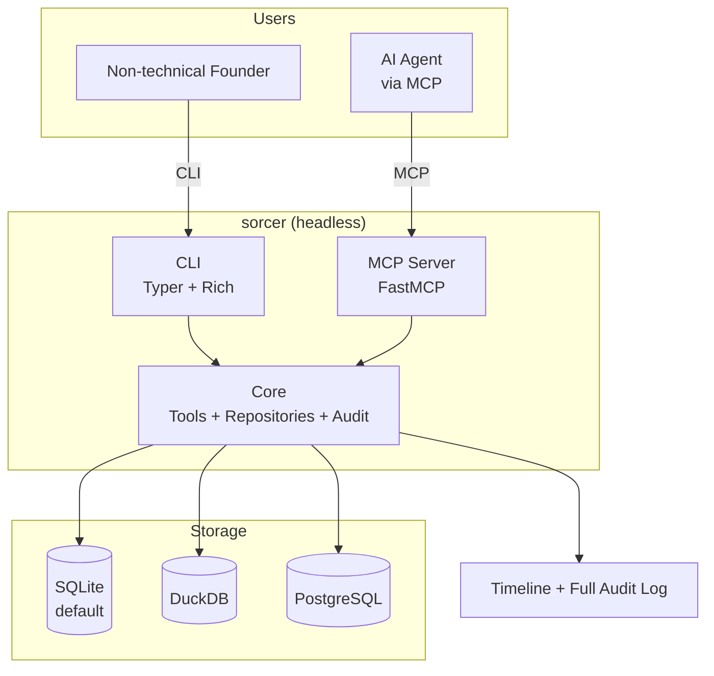

# sorcer

**A minimally viable, headless System of Record for agentic AI startups.**

sorcer gives AI agents a reliable place to store, query, and act on structured business data through a lightweight CLI and MCP interface.

## Why it exists

Agentic startups need a trustworthy source of truth for their operations — people, organizations, activities, tasks, and evolving custom records.

Most CRMs are built for human teams with heavy UIs and complex processes. Raw database tools are too low-level for agents to treat as a proper system of record.

sorcer fills the gap: a simple, agent-native backend that non-technical founders can run with almost zero setup. Frontier AI models interact with it directly via MCP; the AI layer renders the experience (HTML, voice, video, etc.) when needed.

## Fundamental beliefs

- **Agents are primary users.** The system is designed first for AI agents operating through clean, high-signal tools. Humans (founders and operators) use a simple CLI. Traditional employee dashboards are not required.

- **Start simple, grow without friction.** Zero-config SQLite gets you running immediately. The same interface and tools continue to work as you upgrade the storage layer to DuckDB or PostgreSQL.

- **Headless by design.** sorcer is the data foundation, not the application. It exposes data and capabilities; the calling AI decides how to present them.

- **Minimal and self-contained.** A single package with minimal dependencies. A non-technical founder should be able to install it and point their AI at it in minutes.

- **Permissive and portable.** Apache 2.0 license. Data and schema should remain easy to inspect, export, and move.

## Goals

- Deliver a dead-simple, self-contained package (`pip install sorcer` or `uvx sorcer`)
- Provide high-quality MCP tools and an approachable CLI so agents and founders can create, search, relate, and audit records
- Support the core records most startups need (people, organizations, activities, flexible properties, and relations) plus a complete audit trail
- Offer a clear upgrade path to more powerful databases with no changes required to agents or tools
- Stay small and focused so it can be the reliable foundation rather than another complex platform

## What sorcer is not

- A full-featured CRM with built-in dashboards, kanban boards, or employee workflows
- A general-purpose database proxy or low-level SQL tool
- A no-code app builder or visual automation platform

It is the lightweight, trustworthy System of Record that agentic teams and their AI tools can depend on as they scale.

## Architecture



sorcer exposes a clean interface layer (CLI + MCP) over a pluggable storage abstraction. The same high-level tools work regardless of the backend database.

## Project Structure

```text
sorcer/
├── pyproject.toml          # Minimal dependencies, entry points, packaging
├── src/
│   └── sorcer/
│       ├── cli.py          # Typer CLI commands (init, status, mcp, search...)
│       ├── mcp_server.py   # FastMCP server, tools, and resources
│       ├── db.py           # SQLAlchemy engine, sessions, URL handling
│       ├── models.py       # Core SQLAlchemy models (people, orgs, activities, events)
│       ├── schemas.py      # Pydantic models for validation and MCP output
│       ├── repositories.py # Data access layer with built-in audit
│       └── migrations/     # Alembic schema migrations
├── tests/
└── examples/
```

## License

Apache License 2.0

---

Early stage. More documentation, examples, and the MCP tool surface will be added as the project develops.
